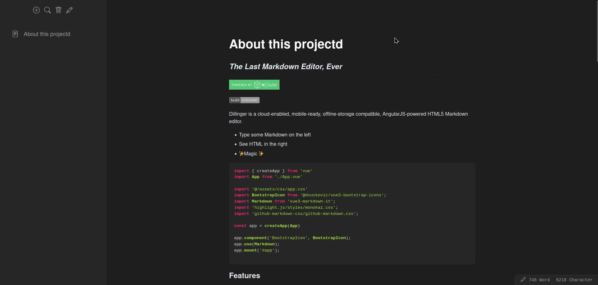

# Markdown Notes App

Markdown Notes App is a web application built with Vue.js and Flask-RESTful for creating and managing markdown-based notes.



## Features

-   Create, read, update, and delete markdown notes.
-   Search functionality to find notes quickly.
-   Responsive and intuitive user interface.
-   Support for different themes.

## Installation

1. Clone the repository:

```bash
git clone https://github.com/your-username/markdown-notes-app.git
```

2. Install backend dependencies:

```bash
cd backend
pip install -r requirements.txt
```

3. Install frontend dependencies:

```bash
cd frontend
npm install
```

## Usage

1. Configure MySQL database settings in `backend/config.py`

```python
DB_PORT = 3306
DB_HOST = 'localhost'
DB_USER = 'root'
DB_PASS = ''
DB_NAME = 'markdown-notes'
```

2. Create posts table

```bash
cd backend
python3 create_db.py
```

3. Run backend API Server

```
python main.py
```

4. Run frontend

```bash
cd frontend
npm run serve
```

5. Open your browser and visit [localhost:8080](http://localhost:8080) to access the application.

## Futures

- [ ] User Sign-in / Sign-Up
- [ ] Private notes
- [ ] Share note via link
- [ ] Realtime updates
- [ ] Posts page for guest
- [ ] Account page

## Contributing

Contributions are welcome! Please check the [Contributing Guidelines](CONTRIBUTING.md) for more information.
